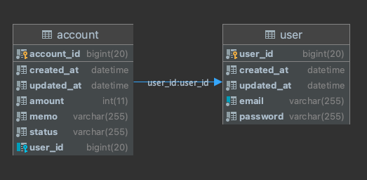

# 가계부 API
사용자가 자신의 오늘 소비내역(금액, 메모)을 기록, 조회, 수정, 삭제, 복구할 수 있음

## 환경 & 기술 스택
- Spring boot: `2.7.4`
- Kotlin: `1.6.21` Java `11`
- Gradle: `7.5`
- Mysql: `5.7`
- JPA
- Spring Security

## 실행방법
```sh
 docker-compose up
```
명령어 하나로 서버 및 DB를 모두 실행할 수 있도록 docker-compose를 사용함

## API List
[👉🏻 API 명세서](https://subari.notion.site/API-cac1e2edec3a4b18a046e1f1fa4d9041)
- 회원가입 API
- 로그인 API
- 가계부 내역 등록 API
- 가계부 내역 수정 API
- 가계부 내역 삭제 API
- 가계부 내역 복원 API
- 가계부 내역 조회 API
- 가계부 내역 상세조회 API

### ERD
